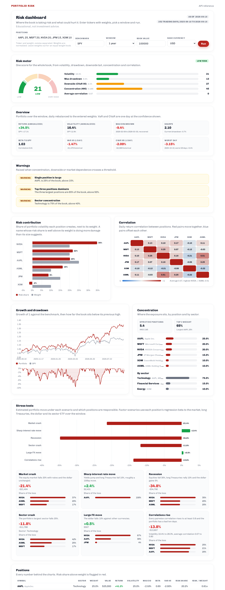

# portfolio-risk-dashboard

A risk dashboard for a stock portfolio. Give it a list of tickers with
weights (or share counts) and it returns return and volatility, maximum
drawdown, concentration, beta and correlation, risk contribution by position,
VaR and CVaR, a risk meter from Low to Very High, warnings when something
crosses a threshold, and six stress scenarios with the positions responsible
for each loss.

The backend is a small FastAPI service. The frontend in `frontend/` is a
working page that draws everything the API returns, built so the same markup
and script can be dropped into an existing site.



## What it shows

| Section | Contents |
| --- | --- |
| Risk meter | One score from 0 to 100 and a level (Low, Moderate, High, Very High) blended from volatility, drawdown, CVaR, concentration and correlation |
| Overview | Annualized return and volatility, max drawdown with dates, Sharpe, beta and correlation to the benchmark, historical VaR and CVaR, worst day and worst 20 days |
| Warnings | Single position too large, top three too large, sector too large, too few effective positions, high volatility, deep drawdown, heavy tail, positions moving together, high beta, a name carrying far more risk than its weight |
| Risk contribution | Each position's share of portfolio volatility next to its weight |
| Correlation | Pairwise correlation heatmap with the average and the most correlated pair |
| Growth and drawdown | Growth of 1 against the benchmark, and the drawdown path |
| Concentration | HHI, effective number of positions, top three weight, weights by position and by sector |
| Stress tests | Market crash, sharp rate move, recession, sector crash, large FX move, correlations rising. Each gives the portfolio move, the money amount and the share of the loss by position |
| Positions | Every number in one table |

How each number is computed is in [docs/methodology.md](docs/methodology.md).

## Layout

```
api/app.py          FastAPI app, request models, static frontend
risk/data.py        prices from Yahoo Finance or a CSV, per ticker cache
risk/metrics.py     return, volatility, drawdown, beta, VaR, CVaR, risk contribution, concentration
risk/stress.py      factor betas and the six scenarios
risk/signals.py     risk meter and warnings
risk/report.py      builds the full report from a list of positions
frontend/           index.html, dashboard.js, dashboard.css
config.py           defaults, factor tickers, scenarios, thresholds, risk meter anchors
main.py             command line report
tests/              pytest suite, runs offline on synthetic prices
examples/           request bodies
docs/               API reference, methodology, integration notes
```

## Setup

```bash
python -m venv .venv
source .venv/bin/activate      # Windows: .venv\Scripts\activate
pip install -r requirements.txt
```

Python 3.10 or newer. Prices come from Yahoo Finance through `yfinance` and
are cached per ticker in `cache/` for 12 hours.

## Run the dashboard

```bash
uvicorn api.app:app --reload
```

Open http://localhost:8000 for the dashboard and http://localhost:8000/docs
for the interactive API reference.

## Run from the command line

```bash
python main.py AAPL:25 MSFT:20 NVDA:20 JPM:15 XOM:10 ASML:10 --value 100000
python main.py AAPL MSFT NVDA --lookback 504 --json > report.json
```

Weights can be on any scale, they are normalized. Tickers without weights get
equal weights.

## Call the API

```bash
curl -X POST http://localhost:8000/api/report \
  -H "Content-Type: application/json" \
  -d @examples/portfolio.json
```

Or with query parameters:

```
GET /api/report?tickers=AAPL,MSFT,NVDA&weights=50,30,20&portfolio_value=100000
```

Positions can also be given as share counts, which is what a broker export
looks like. The value of the book then comes from the latest prices:

```json
{"positions": [{"ticker": "AAPL", "quantity": 30}, {"ticker": "JPM", "quantity": 40}]}
```

The full response is documented in [docs/api.md](docs/api.md).

## Plugging it into a website

The page in `frontend/` is written as one global, `RiskDashboard`, with no
build step and no framework. It needs Chart.js 4 and the markup ids in
`index.html`. To embed it elsewhere, copy the three files, point
`RiskDashboard.init({ apiBase: 'https://your-api' })` at the running service
and keep the ids. `RiskDashboard.render(report)` draws any report object, so
the request can also be built server side. Details, including how the CSS
classes map to a typical card and tile layout, are in
[docs/integration.md](docs/integration.md).

## Configuration

Everything that tunes the numbers lives in `config.py`: the benchmark, the
lookback window, the factor tickers used by the stress tests, the sector ETF
map, the scenario shocks, the warning thresholds and the risk meter anchors.

Environment variables:

| Variable | Purpose |
| --- | --- |
| `PRICES_CSV` | Path to a CSV with a `Date` column and one column per ticker. Replaces Yahoo Finance, useful offline or for a fixed dataset |
| `CACHE_DIR` | Where price and ticker info caches are written, default `cache/` |
| `CACHE_TTL_HOURS` | How long a cached price file is reused, default 12 |
| `ALLOWED_ORIGINS` | Comma separated CORS origins, default `*` |

## Tests

```bash
pytest
```

The tests build a synthetic price file with a market, rate and dollar factor
and never touch the network.

## Notes

The numbers are educational. Betas are simple regressions on daily returns
over the chosen window, historical VaR only knows the days it has seen, and the
scenarios are stylized shocks rather than forecasts. Treat the output as a way
to make a risk discussion concrete, not as a limit system.
